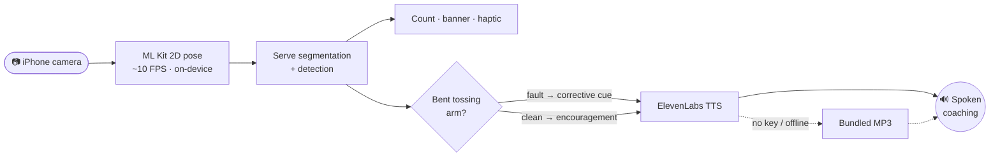
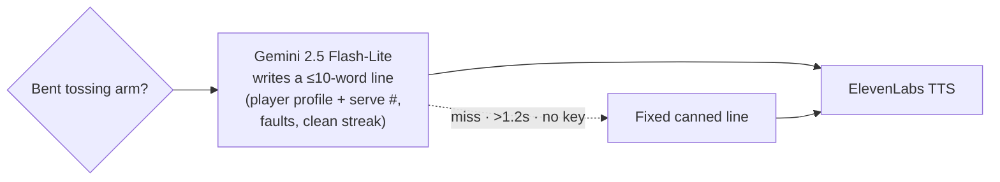

# 🦫 AI Beavers — Serve Detect

**Real-time, on-device tennis serve coaching on an iPhone.** Point the camera at
the baseline, serve, and the app detects each serve, flags a specific technique
fault — a **bent tossing arm** — and speaks an instant coaching cue out loud. No
wearables, no cloud, no account for the core loop.

A coach spots a bad ball toss in a glance; a player practicing alone can't. Serve
Detect turns the phone into that second pair of eyes.

---

## How it works



1. **See** — the camera feed runs through Google ML Kit 2D pose detection on the
   device (~10 FPS analysis), with a live skeleton overlay.
2. **Detect** — a serve-segmentation pipeline finds each serve from the pose
   stream, increments the count, and fires a banner + haptic.
3. **Judge** — per serve, a trajectory analyzer checks the tossing arm: it should
   stay straight as it lifts the ball to the trophy position. A bent elbow on the
   way up is flagged as a fault ([ADR 0001](.vault/adr/0001-serve-error-class.md)).
4. **Coach** — ElevenLabs speaks one short line per serve: a corrective cue on a
   fault, encouragement when clean. If there's no key or the call fails, a
   pre-bundled MP3 of the same line plays — **the app always talks.**

Everything but the spoken line is on-device and instant.

---

## Run locally

**Prerequisites:** macOS + Xcode, [XcodeGen](https://github.com/yonaskolb/XcodeGen),
[CocoaPods](https://cocoapods.org), and a **physical iPhone** (camera + pose
performance are not meaningful on the simulator).

```bash
# 1. Create your local secrets file (gitignored — never commit it)
cp Secrets.swift.example AiBeaversServeDetect/Voice/Secrets.swift

# 2. Generate the Xcode project and install the one pod (ML Kit pose)
xcodegen generate
pod install

# 3. Open the workspace and run the AiBeaversServeDetect scheme on your iPhone
open AiBeaversServeDetect.xcworkspace
```

### Voice keys

Open `AiBeaversServeDetect/Voice/Secrets.swift` and fill in:

| Field | What it is | Required? |
|-------|------------|-----------|
| `elevenLabsAPIKey` | Your [ElevenLabs](https://elevenlabs.io) API key (Profile → API key). Powers the live spoken coaching. | **Yes** for live voice. Empty → the app falls back to bundled MP3 lines and still talks. |
| `elevenLabsVoiceID` | Which ElevenLabs voice speaks. Defaults to `"Rachel"` (`21m00Tcm4TlvDq8ikWAM`); swap in any voice ID from your account. | No — a sensible default ships. |

> Detection and serve-counting work with **no keys at all** — keys only affect the
> spoken line.

---

## What we explored next

On the `feat/llm-coaching-line` branch we prototyped a smarter voice path: instead
of two fixed lines, a fast LLM writes a personal, session-aware cue per serve.



It sits behind a swappable `CoachingProvider` protocol with a layered, never-silent
fallback (Gemini → canned line → ElevenLabs → bundled MP3), so an empty key is a
clean no-op. **We ran out of hackathon time to finalize and tune the pipeline on
device**, so `main` ships the reliable two-line ElevenLabs path above. Design notes
in [ADR 0002](.vault/adr/0002-llm-coaching-line.md).

---

## Stack

- **Swift / SwiftUI**, iOS — native, single screen
- **Google ML Kit Pose Detection** — the only pod; on-device 2D pose
- **ElevenLabs** — text-to-speech coaching
- **XcodeGen** + **CocoaPods** — project & dependency setup
- Fully on-device detection — no uploads, no backend

## Conventions

This repo follows the standard agent conventions. See [`AGENTS.md`](AGENTS.md) for
durable rules and [`.vault/`](.vault/) for the persistent agent knowledge base.
